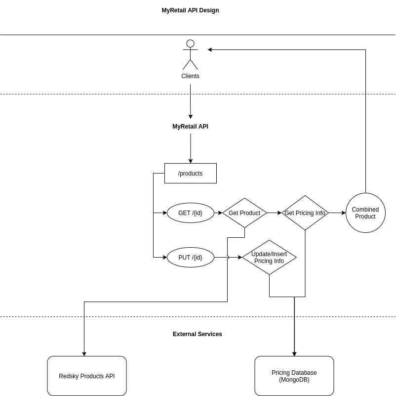

# Design

The MyRetail application combines product information from another microservice
with pricing information from a NoSQL database. It also has the ability to
update pricing information for a particular product. This API has 2 endpoints:

### GET /products/{id}

Retrieves product information from the product microservice and combines it
with the product's pricing information in the database.

### PUT /products/{id}

Updates pricing information for a product if it exists in the database or
creates new pricing information if does not currently exist.

## Tech Stack

### Database

This project requires a NoSQL database to provide pricing information for
products. The information being stored is fairly simple, just the price
and currency code (and an ID to link back to the product). Joins are not
required. In addition, the operations would be read heavy (get current price),
with occasional price updates or inserts. Because of this, MongoDB was chosen.
Mongo is a general purpose document database, so it is performs well for reading
and occasional writes.

Cassandra was also considered as a database. Cassandra is a wide-column database,
meaning it partitions data at the column level instead of at the row level like
in a traditional database. Because of this, it is incredibly fast for writes (since
it is just appending data) and can perform quick reads if the queries are at the
primary key level. However, updates are slow since it needs to update replicated
data across nodes to ensure consistency. If price updates were to become frequent
(such as during holiday season), API performance could suffer.

### Framework

For this project, it was decided to use Java and Spring Boot as the language
and framework. The reason for this is that the team's core services are also
written in Java and Spring, so this tech stack would promote cross-functionality.
Spring Boot is also decently performant and provides an incredible amount of
abstractions for basic NoSQL database operations and Rest API's. For example,
the query logic for MongoDB is built into a `MongoRepository` parent interface,
so one simply has to use Spring to instantiate a bean of the child interface to
be able to call common Mongo queries.

There are plenty of languages and frameworks that would accomplish
the task just as well. FastAPI would be a great choice for Python. Express.js
would also work well on a Javascript centric team. Even within Java, there are
other options (Quarkus, Dropwizard, Javalin, etc.). However, having commonality
in languages as well as frameworks would make it easier to add new features and
maintain the app for other members of the team.
